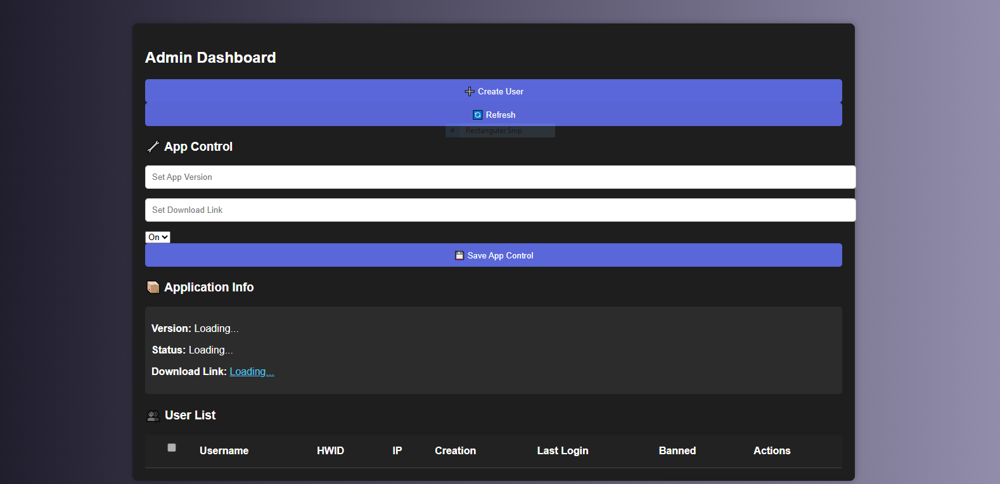

# 📦 UserDatabase-Using-Firebase



> A powerful web-based **Admin Dashboard** built with Firebase Realtime Database. Designed to manage users, HWIDs, bans, and application controls (like version, status, and download link) — similar to KeyAuth but completely custom and flexible.

## 🚀 Features

- 🔐 Admin Login (secured by Firebase Auth)
- 👥 Create & manage users (username, password, HWID)
- 🚫 Ban/Unban users
- 📄 View user IPs, creation date, last login
- 🧠 HWID Lock & Reset
- 📦 Application Info Display:
  - Version
  - Status (On/Off)
  - Download Link
- ⚙️ App Control Panel: Easily update version, status, and download URL
- 🎨 Styled with CSS + Particles.js background

## 📁 Project Structure

```
UserDatabase-Using-Firebase/
├── index.html          # Admin Dashboard
├── login.html          # Admin Login Page
├── css/
│   └── styles.css      # Dark theme + animated styling
├── js/
│   └── script.js       # Firebase logic
├── img/
│   └── logo.png        # Optional custom logo or background
└── README.md           # You're here!
```

## 🛠️ Setup Instructions

1. **Clone the Repo**

```bash
git clone https://github.com/ostwrafi/UserDetabase-Using-Firebase.git
cd UserDetabase-Using-Firebase
```

2. **Firebase Setup**
   - Go to [Firebase Console](https://console.firebase.google.com/)
   - Create a new project
   - Enable **Authentication** (Email/Password)
   - Enable **Realtime Database** and set rules:
     ```json
     {
       "rules": {
         ".read": "auth != null",
         ".write": "auth != null"
       }
     }
     ```
   - Go to **Project Settings > Web** and copy your Firebase config

3. **Insert Firebase Config**
   - Open `js/script.js`
   - Replace the `const firebaseConfig = { ... }` with your config

4. **Start Using**
   - Open `login.html` in a browser
   - Log in using a Firebase Admin account (create one manually via Firebase Auth)
     
## Using in C# Windows from application Login From
**Add Config**
  ```C#
     
       // Firebase config
private const string firebaseDbUrl = "https://myappauthsystem-default-rtdb.firebaseio.com/users/";

  
// HWID generator
private string GetHWID()
{
    string hwid = "";
    using (var mc = new ManagementClass("Win32_ComputerSystemProduct"))
    {
        foreach (ManagementObject obj in mc.GetInstances())
        {
            hwid = obj.Properties["UUID"].Value.ToString();
            break;
        }
    }
    return hwid;
}
public class AppControlInfo
{
    public string version;
    public string status;
    public string link;
}

public async Task<AppControlInfo> GetAppControlAsync()
{
    using (HttpClient client = new HttpClient())
    {
        string url = "https://myappauthsystem-default-rtdb.firebaseio.com/appControl.json";
        var response = await client.GetStringAsync(url);
        JObject json = JObject.Parse(response);

        return new AppControlInfo
        {
            version = (string)json["version"],
            status = (string)json["status"],
            link = (string)json["link"]
        };
    }
}
 ```
**App Control**
  ```
 private async void CheckAppControl()
 {
     try
     {
         var appControl = await GetAppControlAsync();

         if (appControl.status == "off")
         {
             this.Hide();
             MessageBox.Show("The application is currently disabled. Please try again later.");
             Environment.Exit(0); 
         }

         string currentVersion = "1.0.0"; 
         if (appControl.version != currentVersion)
         {
             var result = MessageBox.Show("A new version is available! Do you want to download it now?", "Update Available", MessageBoxButtons.YesNo);
             if (result == DialogResult.Yes)
             {
                 System.Diagnostics.Process.Start(appControl.link);
                 Environment.Exit(0);
             }
             else
             {
                 Environment.Exit(0); 
             }
         }
     }
     catch (Exception ex)
     {
         MessageBox.Show("Error checking app control: " + ex.Message);
         Environment.Exit(0);
     }
 }
 ```
**Login Button Code**
  ```
        private async void guna2Button1_Click(object sender, EventArgs e)
        {
           

            string username = User.Text;
            string password = Pass.Text;
            string hwid = GetHWID();

            xd.Text = "[+] Checking credentials...";
            xd.ForeColor = Color.Yellow;

            using (HttpClient client = new HttpClient())
            {
                try
                {
                    string url = $"{firebaseDbUrl}{username}.json";
                    var response = await client.GetAsync(url);
                    string result = await response.Content.ReadAsStringAsync();

                    if (result == "null")
                    {
                        Loginerror("User not found.");
                        return;
                    }

                    var json = JObject.Parse(result);

                    if (json["password"]?.ToString() != password)
                    {
                        Loginerror("Wrong password.");
                        return;
                    }

                    if (json["banned"]?.ToObject<bool>() == true)
                    {
                        Loginerror("User is banned.");
                        return;
                    }

                    // First login: Save HWID
                    if (string.IsNullOrEmpty(json["hwid"]?.ToString()))
                    {
                        var updateData = new JObject { ["hwid"] = hwid, ["lastLogin"] = DateTime.Now.ToString() };
                        var content = new StringContent(updateData.ToString(), Encoding.UTF8, "application/json");
                        await client.PatchAsync(url, content);
                    }
                    else if (json["hwid"]?.ToString() != hwid)
                    {
                        Loginerror("HWID mismatch.");
                        return;
                    }

                    LoginSucces();
                }
                catch (Exception ex)
                {
                    Loginerror("Error: " + ex.Message);
                }
            }
        }
        private void LoginSucces()
        {
            xd.Text = "[+] Login success!";
            xd.ForeColor = Color.Lime;
            this.Hide();
            RuntimeBroker main = new RuntimeBroker();
            main.Show();
        }

        private void Loginerror(string msg)
        {
            xd.Text = "[x] " + msg;
            xd.ForeColor = Color.Red;
        }


  ```
## 🧠 How It Works

- **Admin Login**: Uses Firebase Auth to protect access.
- **User Creation**: Admin can add username/password/HWID; stored under `/users/username/` in Realtime DB.
- **HWID Lock**: Clients compare saved HWID with local device before allowing app use.
- **App Control**: Admin updates version, status (on/off), and download URL under `/appControl/`.
- **Live Dashboard**: Automatically pulls app info and user stats using Firebase listeners.

## 🔒 Security Tips

- Never expose this dashboard publicly without auth.
- Use HTTPS for production.
- Regularly rotate admin credentials.


## 📜 License

This project is licensed for **educational use only**. Do not use for malicious purposes.
